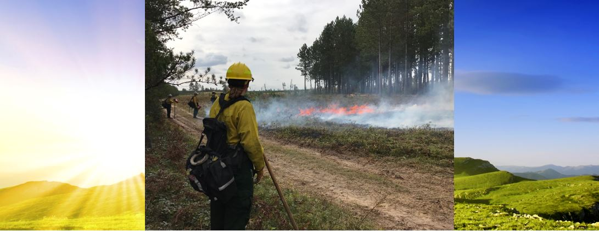
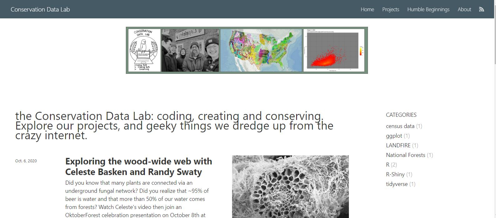

## Models to Assist in Fuels Planning

Brandon Caltrider
Biology/Ecology student at Northern Michigan University (expected graduation spring 2021)
Volunteer with [the Conservation Data Lab](https://rswaty.github.io/TheCDL/)

--- .class #id 

## Goals of presentation

* Cue up conversation about future learning and tool use opportunities
* Share how LANDFIRE source Data is relevant to each model
* Explore four fire behavior models that may or may not be of use to the Ottawa National Forest

--- .class #id 

## Method to the Madness

Initial research yielded a wealth of tools that seemed to fit into three categories; preventative, active, and emissions modeling.
* [BlueSky Framework](https://www.fs.usda.gov/pnw/tools/bluesky-framework)
* [FFT (Fire and Fuel Tools 3.0)](https://www.fs.usda.gov/ccrc/tools/fuel-fire-tools-fft)
* [IFTDSS (Interagency Fuels Treatment Decision Support System)](https://iftdss.firenet.gov/landing_page/)
* [FlamMap6](https://www.firelab.org/project/flammap)

--- .class #id 

## Blue Sky Framework

* Passive and active emissions modeling 
* Web based platform that supports emissions planning through ground monitoring networks, daily smoke forecasts, and customized emissions modeling
* Produces easily digestible graphics and maps

--- .class #id 

## Creating a Landscape in BlueSky

* BlueSky Framework’s Modeling Playground pulls source data from LANDFIRES FCCS (Fuel Characteristic Classification System)

--- .class #id 

## BlueSky Emissions Outputs

* Total GHG, PM 2.5, and PM 10.0 released are compiled into and easily digestible graphic
* Emissions are also visualized in tons per hour 

--- .class #id 

## Fuel and Fire Tools 3.0 (FFT)

* A desktop application that is capable of preventative and active emissions modeling using LANDFIRE supplied data
* Software is not capable of pulling data directly from sources, must be uploaded 
* Creation of custom fuelbeds for a burn unit of interest can be conducted easily 

--- .class #id 

## Fuel and Fire Tools 3.0 Interface

* Interface for FFT3.0 where users build customized “units” as a list of fuelbeds for a given area of interest (AoI)
* This tool can yield high resolution emissions modeling for prescribed burns before they occur. 
* Managers can upload a shapefile of the AoI and quickly generate representative outputs

--- .class #id 

## Landscapes in FFT 3.0

* This slide shows the user interface for FFT3.0 where users build customized Burn Unit; e.g a planned prescribed burn.

--- .class #id 

## FlamMap6

* A desktop application capable of preventative and active fire behavior modeling 
* Inputs can be derived from LANDFIRE data to create high resolution custom landscapes 
* Outputs including fire behavior metrics like Minimum Travel Time, Flame Length, and Line Intensity can be calculated and explored Google Earth

--- .class #id 

## IFTDSS (Interagency Fuel Treatment Determination System)

* Interactive web based application that allows for fire behavior modeling and burn probability modeling
* Users simply input a shapefile of the proposed AOI from which IFTDSS then builds a landscape using LANDFIRE derived data
* Outputs of btu/unit area, and flame length can then be immediately explored in an online interactive map 

--- .class #id 

## the Conservation Data Lab (CDL)

* Is a team focused on creating products that push conservation forward.  We perform research, conduct data analysis and generate data visualizations
* For example, Myles Walimaa wrote R code that can process the raster data inputs needed for development of custom fuelbeds to use in FFT 3.0
* The CDL can help you take outputs from fuel modeling tools and create infographics, dashboards or interactive charts

